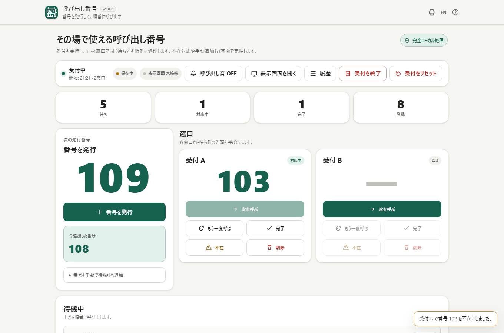
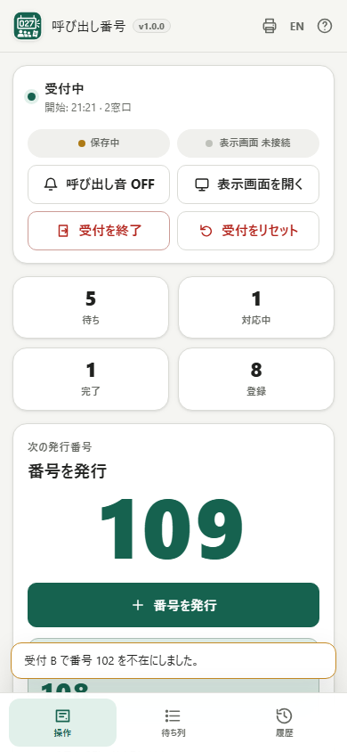

# Queue Board / 呼び出し番号

[](https://github.com/ttomohisa/htmlapps-queue-board/actions/workflows/deploy-pages.yml)
[](LICENSE)
[](queue-board.html)

[English README](README.md)

小規模イベント、一時受付、商品受け渡しなどで、番号を発行し、待ち列を管理して、順番に呼び出すためのローカル優先・単一HTMLアプリです。

## 🚀 デモ

### [GitHub PagesでQueue Boardを開く](https://ttomohisa.github.io/htmlapps-queue-board/)

GitHub Pagesから最初のHTMLを読み込んだ後、Ticket番号、待ち列、窓口設定、履歴、Display状態はブラウザ内で処理されます。Sessionデータを外部APIや分析サービスへ送信しません。

[](https://ttomohisa.github.io/htmlapps-queue-board/)

## 主な機能

- **番号をすぐ発行** — 連番Ticketの発行に加え、既存の整理券番号を手動で待ち列へ追加できます。
- **1〜4窓口で運用** — 各窓口から呼び出し・再呼び出し・完了・不在を操作し、同じ待機Ticketの二重取得を防ぎます。
- **待合向けDisplay** — 同じブラウザの別ウィンドウへ大きな番号表示を開き、外部モニターへ移して使えます。
- **現場の受付フローに対応** — 待機・不在一覧、不在から待ち列への復帰、Ticket削除、対応操作のUndoを備えます。
- **進行中Sessionを自動保存** — ページを再読み込みしても、この端末に残っている受付を再開できます。
- **履歴を確認してCSV保存** — すべての履歴または現在の状態フィルタの結果を、件数とファイル名を確認してUTF-8 BOM付きCSVで保存できます。Session Summaryは常にすべてを保存します。
- **番号札も同じアプリで準備** — A4 / Letter、印刷プレビュー、ブラウザ印刷で簡易整理券を作成できます。
- **PC / スマートフォン対応** — スマホでは「操作 / 待ち列 / 履歴」の下部ナビとsafe-area対応UIを使います。
- **日本語 / 英語** — アプリUI、Help、READMEを日英で用意しています。
- **実行時データを外へ送らない** — 外部API、分析、テレメトリー、実行時パッケージ依存はありません。

## すぐに使う

### Webで使う

[GitHub Pagesのデモ](https://ttomohisa.github.io/htmlapps-queue-board/)を開くだけで利用できます。アカウント登録やインストールは不要です。

### 単一HTMLをダウンロードして使う

リポジトリの [queue-board.html](queue-board.html) をダウンロードし、対応ブラウザで開いてください。読みやすい単一HTML版は `file://` から直接利用できます。

### ビルドして使う

1. このリポジトリをダウンロードまたはクローンします。
2. Windowsで `build-standalone.bat` を実行します。
3. 読みやすい単一HTML版は `dist/index.html` に生成されます。
4. より小さいgzip自己展開版は `dist/index.self-extract.html` に生成されます。

Queue Boardは実行時の外部ライブラリを使用しないため、通常利用時にnpm、CDN、外部APIは必要ありません。

## 使い方

ヘッダーのEN / JAで言語を切り替えます。待ち列・呼び出し状態・履歴の絞り込み・CSVの保存範囲とファイル名は保持されます。

1. 開始番号と1〜4個の窓口を設定します。必要なら窓口名やDisplay設定も変更できます。
2. 受付を開始し、「番号を発行」で連番Ticketを追加します。既存番号は手動追加できます。
3. 空いている窓口で **「次を呼ぶ」** を押すと、待ち列の先頭Ticketをその窓口へ割り当てます。
4. 必要に応じて **「もう一度呼ぶ」 / 「完了」 / 「不在」** を使います。不在Ticketは待ち列の末尾へ戻せます。
5. **「表示画面を開く」** で、待合向けDisplayを同じブラウザの別ウィンドウへ開けます。
6. **「履歴」** ではTicketごとの時系列を確認できます。受付終了後はSession Summaryを表示し、終了済みSessionを端末内へ保存します。
7. 履歴の **「CSVの保存範囲」** で **「すべて」**（初期値）または **「現在の絞り込み」** を選び、件数とファイル名を確認してCSVを保存します。絞り込み結果が0件の場合は保存できません。Session Summaryでは常にすべてのTicketを保存します。

ファイル名は同じ受付の履歴とSession Summaryで共有し、受付終了・言語切替・画面移動でも保持します。拡張子は`.csv`固定で、使用できない文字は保存時のみ取り除きます。名前と保存範囲はメモリ上だけで保持し、ページ再読み込みや新しい受付で初期値へ戻ります。保存済みSessionのデータには追加しません。

連番は0〜999999の範囲で、上限に達すると停止し、000へは戻りません。未使用番号は手動で追加できます。連番を再開する場合は新しい受付を開始してください。

受付の終了・リセット・保存済み受付の破棄中は、保存が終わるまで番号操作を一時停止します。保存に失敗した場合は受付を保持し、再試行できます。確認のキャンセルでは受付は変わりません。

### スマートフォン

受付中のスマートフォンでは、下部の **「操作 / 待ち列 / 履歴」** で画面を切り替えます。PC画面を単純に縦積みするのではなく、主要操作と一覧を分けて表示します。



### 番号札を印刷する

ヘッダーのプリンターボタンから番号札作成画面を開き、以下を設定できます。

- 開始 / 終了番号
- 1〜6桁の表示
- タイトル
- A4 / Letter
- 1ページあたり1〜20枚

1回の印刷で作成できる番号札は **最大1000枚** です。実際の印刷余白や倍率は、ブラウザ、OS、プリンタードライバー、印刷ダイアログの設定によって変わる場合があります。

## プライバシーと通信防止

Queue Boardでは、Ticket番号、Session状態、履歴、設定、印刷用番号札をブラウザ内で処理します。

待合向けDisplayは同じアプリを別ウィンドウで開き、状態はブラウザ標準の `postMessage` / `BroadcastChannel` で同期します。Queue Boardのサーバーや別端末へ受付状態を送信する仕組みではありません。Web版でDisplayを開くと同じHTMLを再取得する場合がありますが、Session状態はそのリクエストへ含まれず、`#display=...` のフラグメントもブラウザ内だけで扱われます。

生成HTMLのContent Security Policyは `connect-src 'none'` です。実行時の `fetch`、XHR、WebSocket、EventSource、`sendBeacon`、WebTransport、WebRTC、外部API、分析、テレメトリーは使用しません。

GitHub Pages版では最初のHTMLを取得する通信は発生します。ネットワークを完全に切って使う場合は、`dist/index.html` または `queue-board.html` をローカルで開いてください。

## 対応ブラウザ / 端末

主対象:

- 最新のChrome
- 最新のEdge

可能な範囲で対応:

- Firefox
- Safari

PCとスマートフォン向けレイアウトを用意しています。FullscreenとScreen Wake Lockはブラウザ対応状況に依存しますが、利用できない場合でも受付・呼び出しの基本機能は使用できます。

## 制限事項

- Display同期は **同じブラウザ環境の別ウィンドウ / タブ** までです。v1.0.0では別端末への同期は行いません。
- SMS、メール通知、オンライン予約、クラウド同期、顧客名・電話番号管理、決済、スタッフアカウント・権限管理はありません。
- 進行中Sessionの復旧はブラウザの保存領域に依存します。サイトデータ削除、プライベートブラウズの制限、保存ポリシー、端末故障などでは復旧できない場合があります。
- 複数店舗やサーバーで統合管理するQueue Management Systemではなく、その場の一時受付向けです。
- 通常利用は1 Session **1000 Ticket程度** を想定しています。非常に大きな履歴は端末メモリを多く使用する場合があります。
- 番号札は1回の印刷で **最大1000枚** です。
- 印刷結果はブラウザ・OS・プリンター設定によって差が出る場合があります。

## 単一HTML / オフライン

ビルドすると以下を生成します。

```text
dist/index.html
dist/index.self-extract.html
queue-board.html
```

読みやすい単一HTML版と自己展開版のどちらも、アプリUI、JavaScript、SVGアイコン、翻訳、印刷CSS、チャイム生成に必要な処理を含みます。

オフライン確認手順は [VERIFY_OFFLINE.md](VERIFY_OFFLINE.md) を参照してください。

## 開発とビルド

```text
.
├─ src/index.template.html       # アプリ本体テンプレート
├─ app.config.json               # アプリ情報・リリース版数
├─ assets/favicon.svg            # アプリアイコン / favicon の正
├─ dependencies.json             # 実行時パッケージ一覧（Queue Boardは空）
├─ build-standalone.bat          # Windows用ビルド入口
├─ build-standalone.ps1          # 単一HTML生成
├─ scripts/check-repository.ps1  # リポジトリ / リリース検証
└─ dist/                         # 生成されるstandalone成果物
```

検証:

リポジトリ検証にはNode.js 24が必要です（開発時のみ。npm installは不要）。保存の遅延・拒否、確認の繰り返し、受付再開、番号上限、CSVの全件・絞り込み出力、ファイル名、ダウンロード失敗の回帰テストを、ソースと生成された読みやすいHTMLの両コピーで実行します。

```powershell
powershell.exe -NoLogo -NoProfile -ExecutionPolicy Bypass -File .\scripts\check-powershell-syntax.ps1
pwsh -NoLogo -NoProfile -File .\scripts\check-repository.ps1
```

`dist/index.html`、`dist/index.self-extract.html`、`queue-board.html` は生成物です。直接編集せず、`src/index.template.html` や設定・ビルド処理を変更してください。

## 使用ライブラリ

Queue Board v1.0.0は **実行時のサードパーティライブラリを内包していません**。IndexedDB / localStorage、Web Audio、Fullscreen、Screen Wake Lock、`postMessage`、`BroadcastChannel` などのブラウザAPIを直接使用します。

リポジトリ上のNotice方針は [THIRD_PARTY_NOTICES.md](THIRD_PARTY_NOTICES.md) を確認してください。

## コントリビューション

バグ報告や機能提案はIssueからお願いします。開発への参加方法は [CONTRIBUTING.md](CONTRIBUTING.md) を参照してください。

## ライセンス

Copyright © 2026 ttomohisa

このプロジェクトは [MIT License](LICENSE) で公開されています。
