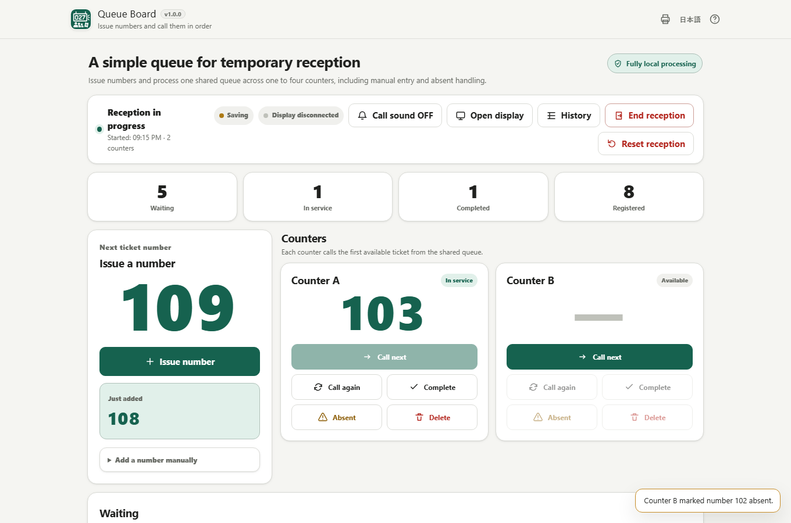

# Queue Board

[](https://github.com/ttomohisa/htmlapps-queue-board/actions/workflows/deploy-pages.yml)
[](LICENSE)
[](queue-board.html)

[日本語版 README](README.ja.md)

A local-first, single-HTML queue-number app for temporary reception desks, small events, pickup counters, and other situations where you need to issue numbers and call people in order.

## 🚀 Live demo

### [Open Queue Board on GitHub Pages](https://ttomohisa.github.io/htmlapps-queue-board/)

GitHub Pages delivers the initial HTML. After it loads, Ticket numbers, queue state, Counter settings, History, and Display state are processed in the browser. Queue Board does not send Session data to an external API or analytics service.

[](https://ttomohisa.github.io/htmlapps-queue-board/)

## Features

- **Issue queue numbers quickly** — Create sequential Tickets or add an existing number manually.
- **Run one to four Counters** — Each Counter can call, recall, complete, or mark its current Ticket absent without taking the same waiting Ticket twice.
- **Show a waiting-room Display** — Open a large Display in another window of the same browser and move it to an external monitor.
- **Handle real reception flow** — Keep waiting and absent lists, return absent Tickets to the queue, delete queued Tickets, and undo supported deletions.
- **Keep the Session recoverable** — The active Session is automatically saved on the device and can be resumed after a reload.
- **Review and export the day** — Save all History or the current status filter as UTF-8 BOM CSV, with a visible ticket count and editable filename. Session Summary always exports all tickets.
- **Prepare number tickets** — Generate printable number tickets with A4 / Letter layouts, a live preview, and browser printing.
- **Use it on desktop or mobile** — Smartphone operation uses fixed Operate / Queue / History navigation with safe-area support.
- **Use it in Japanese or English** — The application UI, Help, and release documentation are bilingual.
- **Keep runtime data local** — No external API, analytics, telemetry, or runtime package dependency is used.

## Quick start

### Use the web demo

Open the [GitHub Pages demo](https://ttomohisa.github.io/htmlapps-queue-board/). No account or installation is required.

### Use the standalone HTML

Download [queue-board.html](queue-board.html) from this repository and open it in a supported browser. The readable standalone file can be used directly with `file://`.

### Build the standalone files

1. Download or clone this repository.
2. Run `build-standalone.bat` on Windows.
3. Use `dist/index.html` for the readable single-file build.
4. Use `dist/index.self-extract.html` when you want the smaller gzip self-extracting variant.

Queue Board has no runtime third-party package dependency, so normal application use does not require npm, a CDN, or an external API.

## How to use

Use EN / JA in the header to switch languages. Queue and call state, History filters, CSV scope, and the filename stay unchanged.

1. Choose the starting number and one to four Counters. Counter names and Display settings are optional.
2. Start reception and issue sequential Tickets, or add a number manually.
3. At an available Counter, choose **Call next**. The first waiting Ticket is assigned to that Counter.
4. Use **Call again**, **Complete**, or **Absent** as needed. Absent Tickets can be returned to the end of the waiting queue.
5. Choose **Open display** to open the waiting-room Display in another window of the same browser.
6. Use **History** to review Ticket timelines and filters. When reception ends, Queue Board saves the completed Session locally and shows a Session Summary.
7. In History, choose **All tickets** (the default) or **Current filter** under **CSV scope**, check the ticket count, edit the filename if needed, and save CSV. An empty filtered result cannot be exported. Session Summary always saves all tickets.

History and Session Summary share the filename for the same reception, including after it ends and when switching language or views. The `.csv` extension is fixed; unsupported filename characters are removed only when saving. Names and export scope are kept in memory and reset after a page reload or when a new reception starts. They are not added to saved Session data.

Automatic numbers run from 0 to 999999 and stop at the upper limit; they never wrap to 000. You can still add unused numbers manually. Start a new reception to restart the automatic sequence.

While ending, resetting, or discarding a saved reception, ticket-changing controls pause until storage finishes. If storage fails, the reception stays available and you can retry. Canceling the confirmation leaves it unchanged.

### Smartphone operation

During an active Session, smartphones use bottom navigation for **Operate / Queue / History**. Primary operation stays separate from the waiting / absent lists so the desktop layout is not simply squeezed into a narrow screen.


### Number-ticket printing

The printer button in the header opens the ticket-printing screen. You can set:

- Starting / ending number
- 1–6 display digits
- Ticket title
- A4 or Letter paper
- 1–20 tickets per page

A single print job can generate up to **1000 tickets**. Actual printed margins and scale can vary with the browser, operating system, printer driver, and print-dialog settings.

## Privacy and runtime network protection

Queue Board keeps Ticket numbers, Session state, History, settings, and printable ticket data in the browser.

The waiting-room Display is another window of the same application. Live state is synchronized with browser-native `postMessage` and `BroadcastChannel`; it is not sent to a Queue Board server or another device. On the hosted version, opening the Display may request the same HTML document again, but Session state is not included in that request and the `#display=...` fragment remains browser-side.

The generated HTML includes a Content Security Policy with `connect-src 'none'`. The app contains no runtime `fetch`, XHR, WebSocket, EventSource, `sendBeacon`, WebTransport, WebRTC, external API, analytics, or telemetry path.

The hosted demo still needs an initial request to download the HTML. For use with the network completely disconnected, open `dist/index.html` or `queue-board.html` locally.

## Supported browsers and devices

Primary targets:

- Current Chrome
- Current Edge

Supported where practical:

- Firefox
- Safari

Desktop and smartphone layouts are provided. Fullscreen and Screen Wake Lock depend on browser support; when unavailable, the queue itself continues to work.

## Limitations

- Display synchronization is limited to another window/tab in the **same browser profile**. Remote-device synchronization is not part of v1.0.0.
- SMS, email notification, online reservation, cloud synchronization, customer names / phone numbers, payments, and staff-account permissions are not included.
- Active Session recovery depends on browser storage. Clearing site data, private-browsing restrictions, storage policy, or device failure can remove locally saved state.
- Queue Board is designed for temporary on-site operation rather than multi-store or server-coordinated queue management.
- A normal Session is designed around approximately **1000 Tickets**. Very large History lists can increase browser memory use.
- One number-ticket print job is limited to **1000 tickets**.
- Printer output can vary by browser, OS, and printer settings.

## Single HTML and offline use

The build generates:

```text
dist/index.html
dist/index.self-extract.html
queue-board.html
```

The readable standalone HTML and self-extracting variant contain the application UI, JavaScript, SVG icon, translations, print CSS, and generated chime behavior needed at runtime.

See [VERIFY_OFFLINE.md](VERIFY_OFFLINE.md) for the offline verification procedure.

## Development and build

```text
.
├─ src/index.template.html       # Application source template
├─ app.config.json               # App metadata and release version
├─ assets/favicon.svg            # Canonical app icon / favicon
├─ dependencies.json             # Runtime package list (empty for Queue Board)
├─ build-standalone.bat          # Windows build entry point
├─ build-standalone.ps1          # Standalone builder
├─ scripts/check-repository.ps1  # Repository / release validation
└─ dist/                         # Generated standalone artifacts
```

Repository checks require Node.js 24 (development only; no npm install is needed) for deterministic session-state and CSV-export regression tests. They run against the editable source and both readable output copies, including deferred/rejected storage, repeated confirmation, recovery, number exhaustion, full/filtered exports, filenames, and download errors.

Run the repository checks with:

```powershell
powershell.exe -NoLogo -NoProfile -ExecutionPolicy Bypass -File .\scripts\check-powershell-syntax.ps1
pwsh -NoLogo -NoProfile -File .\scripts\check-repository.ps1
```

Generated `dist/index.html`, `dist/index.self-extract.html`, and `queue-board.html` are build outputs and should not be edited by hand.

## Dependencies

Queue Board v1.0.0 bundles **no third-party runtime library**. It uses browser APIs directly, including IndexedDB / localStorage, Web Audio, Fullscreen, Screen Wake Lock, `postMessage`, and `BroadcastChannel`.

See [THIRD_PARTY_NOTICES.md](THIRD_PARTY_NOTICES.md) for repository notice policy.

## Contributing

Bug reports and feature proposals are welcome through GitHub Issues. See [CONTRIBUTING.md](CONTRIBUTING.md) for development guidance.

## License

Copyright © 2026 ttomohisa

Licensed under the [MIT License](LICENSE).
